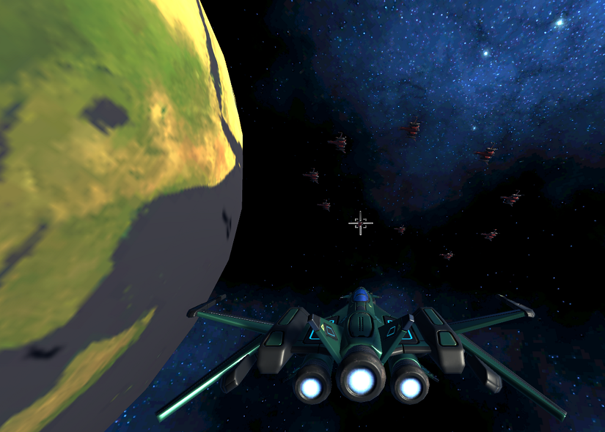
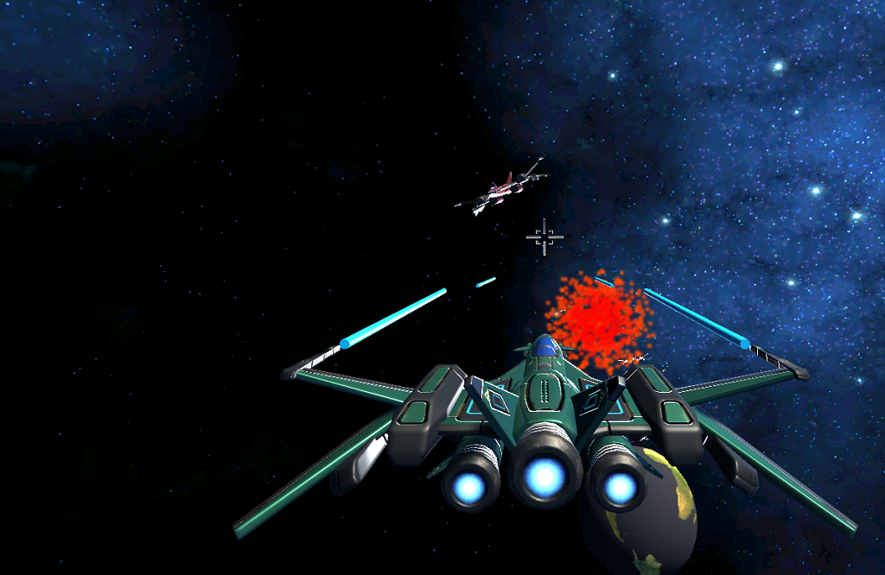
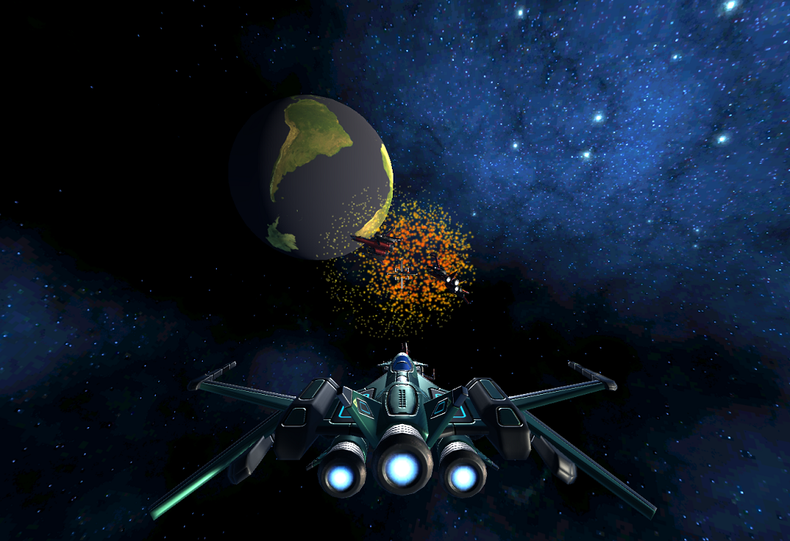

# Earth Defence - 3D shooter

Космический шутер - Earth defence.

Игрок управляет движением корабля и лазерными пушками. 
Цель игры - удерживать земную орбиту от вторжения, захватить орбиты других планет солнечной системы, уничтожая корабли противника. 
Удержание базы происходит если игрок находится на орбите планеты в границах маркированного места базы в течение 30 секунд.
В игре ограничен запас топлива и оружия. Пополнять ресурсы можно на своей базе. Война происходит в пределах солнечной системы.

# version 1.0

-- Борьба за орбиту земли. (сделано)

-- Боты нападают на игрока. (сделано)

-- Игрок стреляет лазерными пушками. (сделано)

# version 2.0

Добавить:

-- Двухкомпонентный прицел (сделано)

-- Инерционность синхронизации прицелов с поворотом корабля (сделано)

# version 3.0

Добавить:

-- Вращение земли, солнце, луну (сделано)

-- Астероиды (могут повредить корабль, но не уничтожить, можно расстреливать лазерами)

-- При столкновении с планетой направление корабля выравнивается с орбитой планеты

-- Радар

# version 4.0

Добавить:

-- Планеты солнечной системы (сделано)

-- Границу вселенной

-- Шкалу health

# version 5.0

Добавить:

~~-- Шкалу fuel~~
~~-- Шкалу ammo~~

-- База Земли и Марса (подсветка, спецэффект) (сделано)

-- Боты летят со стороны Марса (AI modifications) (сделано)

~~-- Захват базы (отображение времени до захвата, смена "флага" владельца)~~

# version 6.0

-- меню

-- музыка

# version 7.0
~~-- сетевая игра~~

# Credits:

  sounds - zapsplat.com
