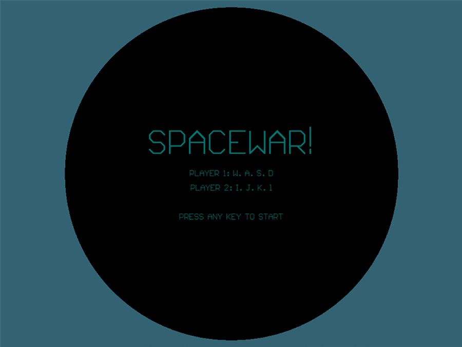

# Space War

Трехмерный шуттер на основе игры spacewar! от Стива Рассела (1962)

Поединки космических кораблей внутри и за пределами солнечной системы. Игрок с помощью клавиатуры управляет силой тяги двигателя корабля и использует маневровые двигатели для смены курса. На носу корабля установлены торпедные аппараты, а в задней части спаренная лазерная туррель. Цель игры найти и уничтожить корабль противника. Для этого достаточно попасть в цель одной из девяти доступных торпед. На траектории кораблей и торпед влияет гравитация солнца и планет. В игре ограничен запас топлива, но корабли могут маневрировать и за границами солнечной системы.

# version 0.0.1
начало игры (выбор корабля первым и вторым игроком, в первой версии игры корабли отличаются только по форме)

объекты

-- Бесконечный космос (можно лететь куда угодно, но топливо конечно)

-- Солнце (если пролететь близко искажает траекторию гравитацией, при столкновении корабль сгорает)

-- Астероиды (могут повредить корабль, но не уничтожить, можно расстреливать лазерами)

-- Планеты и спутники (при столкновении корабль падает на планету)

-- Космический мусор (элементы сеттинга)

-- Корабль

    -- вооружение (корабль стреляет носовыми торпедными аппаратами, лазер расположен в вращающейся башне)

        -- атомные торпеды (9 торпед) (медленные, но только торпедой можно взорвать противника)

        -- лазер (без ограничений, пока есть топливо) (быстрый, выводит из строя радар и маневренные двигатели(малый шанс), но не может взорвать торпеду)

    -- главный двигатель (дает тягу в направлении носа корабля)

    -- маневренные двигатели (управляют вращением)

        -- левый

        -- правый

    -- топливо для главного двигателя (если кончилось, все кроме торпед не работает, корабль движется или вращается по инерции)

    -- гипер-прыжок 3 попытки (работает без топлива, последний шанс избежать столкновения, но можно взорваться при выходе, так как есть шанс врезаться в планету или солнце)

    -- радар (позволяет знать где противник, может искажаться информация солнцем или другими планетами, если противник близко от солнца)

Конец игры

    -- один корабль уничтожен

    -- два корабля без топлива и без торпед (включается таймер и через некоторое время потухают огоньки в кораблях, имитируя отсутствие кислорода или т.п.)

    -- два корабля уничтожены

Тестирование 3D версии

# version 0.0.2
-- добавить AI

# version 0.0.3
-- добавить разные типы кораблей (вооружение не только на носу)

-- добавить разные типы инопланетян (биологическая цивилизация, энергетическая)

# version 0.0.4
-- обучающие миссии, история вселенной и героя

-- добавить награды и квесты

-- добавить экономику и технологии развития

# setting
-- готика (аналог вселенная Warhammer 40 000)

-- стимпанк (аналог вселенная м-ф Миадзаки Небесный замок Лапута)

# fun
-- спрятать пасхалку про Денниса Ритчи и Кена Томпсона, создателей языка C

    -- названия кораблей

    -- шутки про PDP-11 и язык С

-- спрятать пасхалку про создателя Space War Стива Рассела.

    -- названия оружия

    -- древний корабль с Стивом на борту
